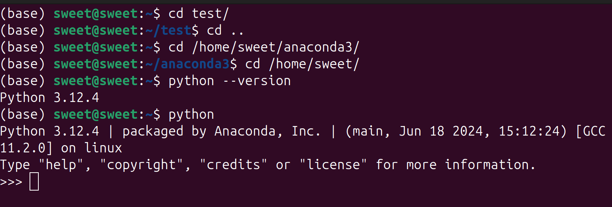
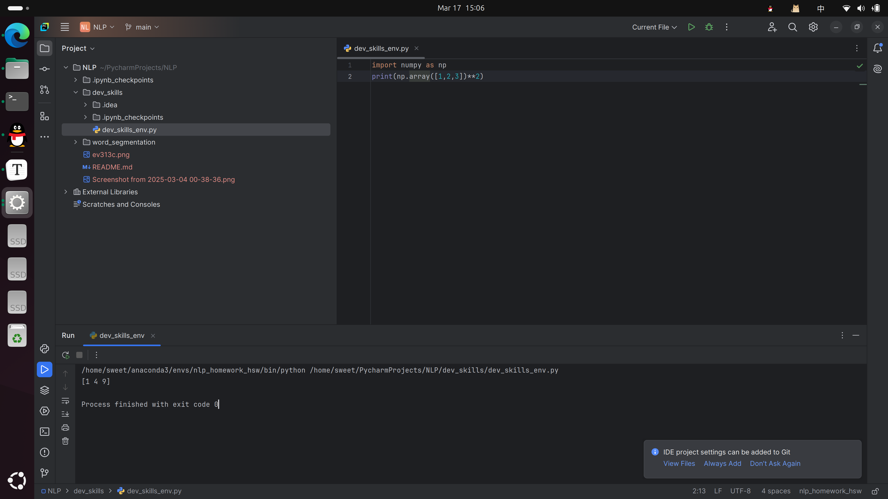

# メア的自我介绍


大家好，为叫**メア•アシュリーペッカー**，住アカデミア在里，以下是我的自我介绍。

## 基础档案

### 外貌特征
- 猫耳朵
- 猫尾巴

### 我的朋友

1.アリアンナ

2.ベルカ

3.ソーマ

### 重要坐标

- **住址**：アカデミア
- **工作单位**：アカデミア

### 日常作息表

| 时间      | 事项 |
| --------- | ---- |
| 8：00 AM  | 上课 |
| 12：00 AM | 吃饭 |
| 2：00 PM  | 上课 |
| 4：00 PM  | 研究 |

### 人生信条

あなた達が死んでもデータは取る。好きにすればいい

---

## 我的专业是意志研究

## 我最喜欢的一段代码

```
import numpy as np
print(np.array([1,2,3])**2)
```

其中执行`print(np.array([1,2,3])**2)`可输出结果。

我最喜欢的环境管理工具是conda

“ **01** 环境搭建的截图 ” 

“ **02** 环境搭建的截图 ”




ps:以上信息大部分出自游戏：**ジュエリー・ハーツ・アカデミア**
